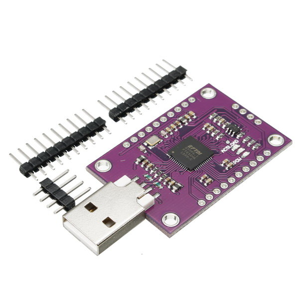
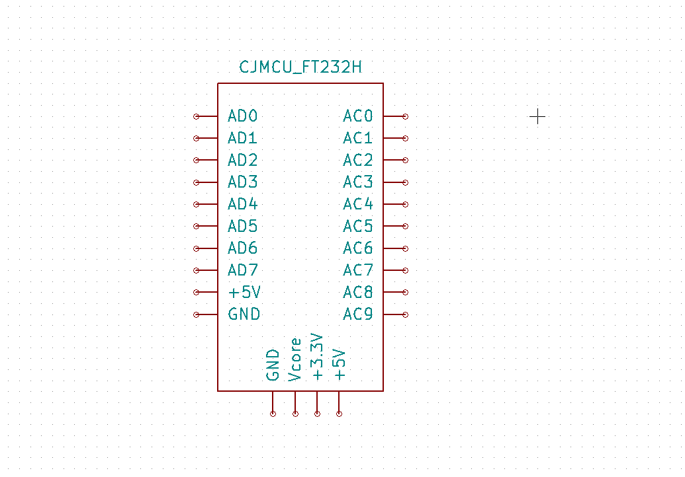
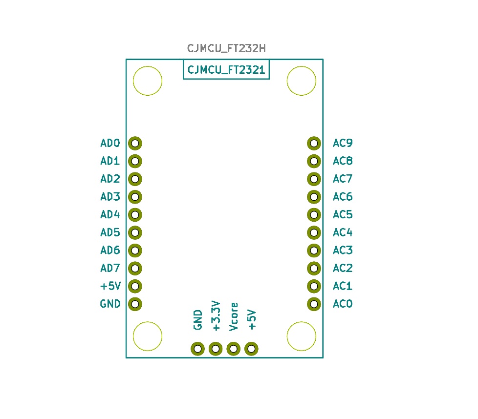

# CJMCU FT232H

KiCad Footprints for CJMCU FT232H Board

## Board

Can be found in Aliexpress for less than 10$

FT232H chipset cheat sheet can be found [here](https://www.ftdichip.com/Support/Documents/DataSheets/ICs/DS_FT232H.pdf).

## Schematic

The pinout schematic

## PCB

Footprint in pcbnew:

> :warning: Remember to link the schematic symbol to the footprint by clicking twice on _Schematic Editor_ in KiCad.